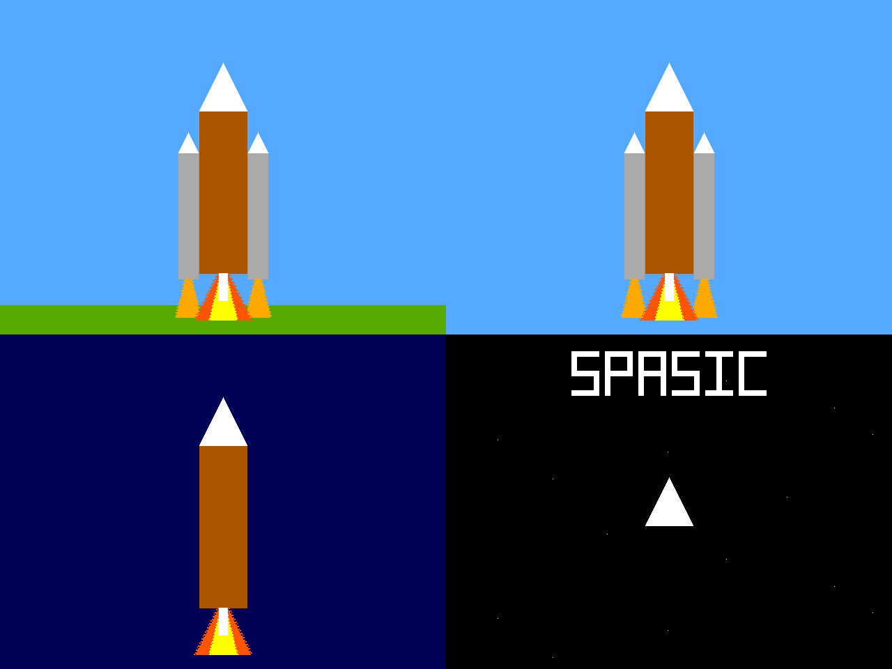
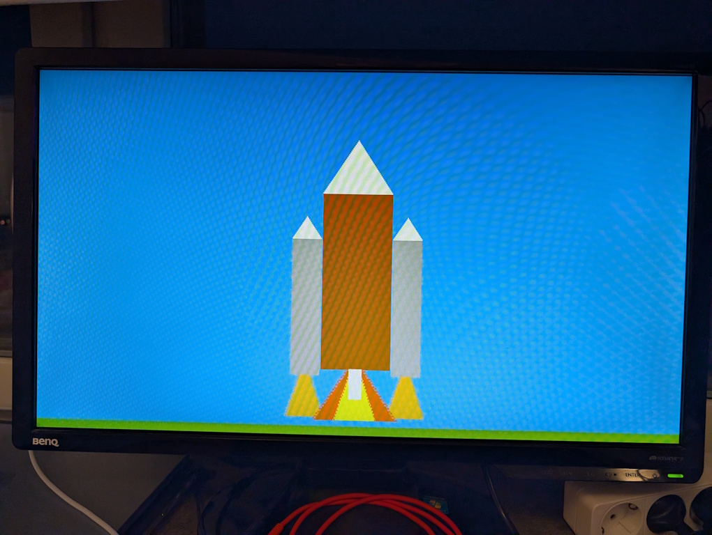
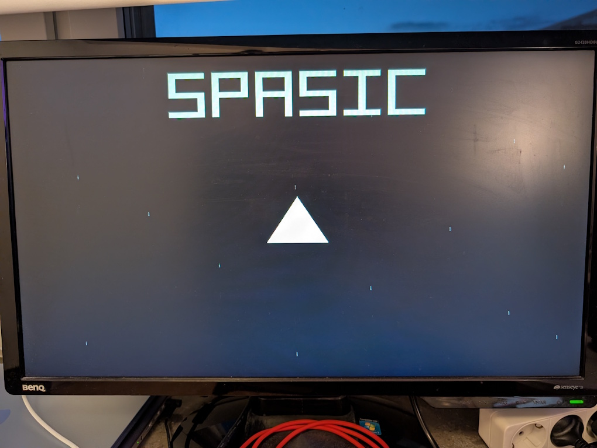

<!---

This file is used to generate your project datasheet. Please fill in the information below and delete any unused
sections.

You can also include images in this folder and reference them in the markdown. Each image must be less than
512 kb in size, and the combined size of all images must be less than 1 MB.
-->

## Introduction

> Me: Mom, can we have SpASICs?
> 
> Mom: No, we have SpASICs at home.
> 
> SpASICs at home:

This is a VGA demo showing a space launch vehicle, consisting of core and upper stages as well as two booster rockets, take off from the ground and fly towards space.

The vehicle passes through several layers of the atmosphere, including a white cloud layer.
After passing the cloud layer, the two boosters are dropped while the core stage continues.
After reaching space, the core stage is also dropped and only the upper stage with the crew module remains.

In space, distant stars can be seen together with the text "SPASIC".

### Design

I am not an artist, but the idea was to start out with something vaguely inspired by the Space Launch System (SLS) used by NASA, and then end up in space with the final stage looking a bit like the craft from an old Asteroids clone.

The transitions between atmospheric "layers" are a bit abrupt, instead of a gradual fade, due to the limited palette.
I am pretty happy with the stars scrolling by while in space, though.

The final utilization (on one tile) ended up being around 60%, but getting rid of the worst timing violations took enough effort that I decided to skip trying to add any audio.

## How it works

The video sync generator module uses 800 pixels per line (640 visible pixels) and 525 lines per frame (480 visible lines). At a pixel clock of 25.175 MHz this gives a frame rate of (25175000/800)/525 = 59.94 Hz.

Instead of 25.175 MHz, the project can optionally be clocked at 25.2 MHz instead.
This results in a frame rate of exactly 60 Hz.

## How to test

Connect the VGA Pmod to a VGA monitor that supports 640x480 @ 59.94Hz (with a 25.175 MHz clock input).
The demo is not interactive - so just wait and see if anything happens.

## External hardware

This project uses the [VGA Pmod](https://tinytapeout.com/specs/pinouts/#vga-output)
